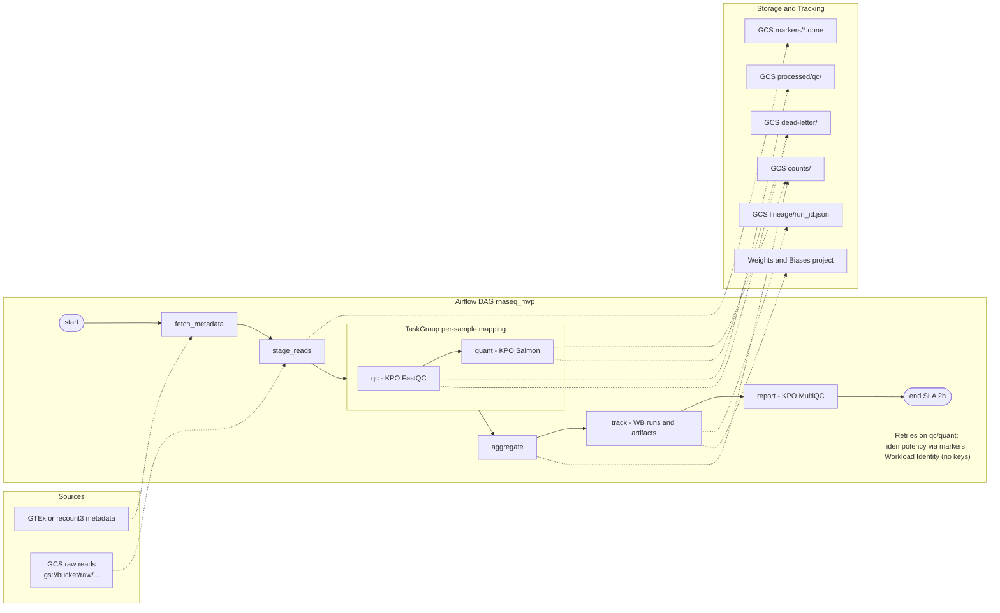

```mermaid
flowchart LR
 subgraph SRC["Sources"]
        M1["GTEx or recount3 metadata"]
        R1["GCS raw reads\n gs://bucket/raw/..."]
  end
 subgraph TG["TaskGroup per-sample mapping"]
        Q1["qc - KPO FastQC"]
        Q2["quant - KPO Salmon"]
  end
 subgraph AF["Airflow DAG rnaseq_mvp"]
        A0(["start"])
        A1["fetch_metadata"]
        A2["stage_reads"]
        TG
        A3["aggregate"]
        A4["track - WB runs and artifacts"]
        A5["report - KPO MultiQC"]
        A6(["end SLA 2h"])
        n1["Retries on qc/quant; idempotency via markers; Workload Identity (no keys)"]

        n1@{ shape: text}
  end
 subgraph STG["Storage and Tracking"]
        W1["GCS processed/qc/"]
        W2["GCS counts/"]
        W3["GCS markers/*.done"]
        W4["GCS lineage/run_id.json"]
        WB["Weights and Biases project"]
        DLQ["GCS dead-letter/"]
  end
    A0 --> A1
    A1 --> A2
    A2 --> TG
    TG --> A3
    A3 --> A4
    A4 --> A5
    A5 --> A6
    Q1 --> Q2
    M1 -.-> A1
    R1 -.-> A2
    Q1 -.-> W1 & DLQ
    Q2 -.-> W2 & DLQ
    A2 -.-> W3
    A3 -.-> W2
    A4 -.-> W4 & WB
```
